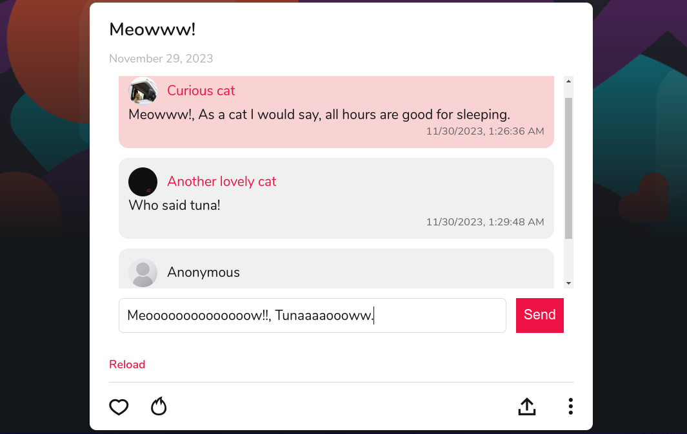

# Get Threads Back!

A chrome extension which brings threads back to the askfm web version.

    

## Getting started

Disclaimer: This project is for educational purposes only.

First you have to grab these keys, [How to get the keys ?](https://ayehia0.github.io/posts/askfm_reverse_engineering/):
- `PRIVATE_KEY`
- `X_ACCESS_TOKEN`

## Installation

1. Put the keys in the `.example.env` and rename to `.env`.
2. Install all the dependencies : `bun install` or `npm install`
3. Build the extension : `bun run build` or `npm run build`
4. Load the extension on the browser from the `dist` dir.

## ToDo

- [X] Show text based threads.
- [X] Add `createAt` to the messages in the thread.
- [X] Add author's name `autherName` to the messages in the thread.
- [ ] Delete from thread.
- [ ] Show images and youtube links.
- [X] Add to thread: threads with replies.
- [ ] Add to any thread: threads without replies.
