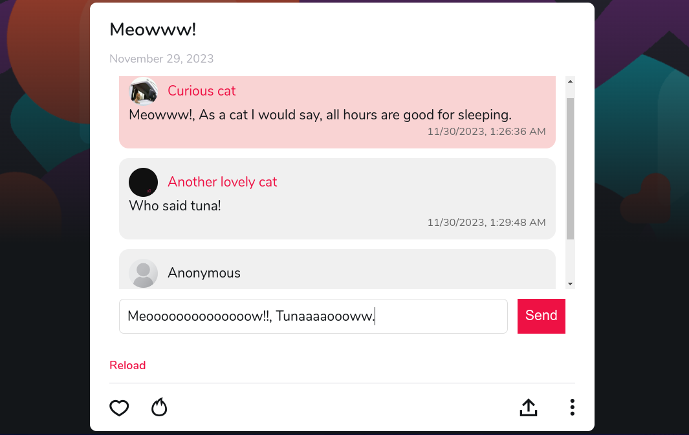

# Get Threads Back!

A chrome extension which brings threads back to the askfm web version.

> ⚠️ **ARCHIVED: This project is no longer maintained.**  
> ❌ **ASKfm officially shut down on December 1, 2024**, as announced by its administrators.  
> 🗃️ This repository is being archived for educational and historical reference.

    

## Getting started

First you have to grab these keys, [How to get the keys ?](https://ayehia0.github.io/posts/askfm_reverse_engineering/):
- `PRIVATE_KEY`
- `X_ACCESS_TOKEN`

## Installation

1. Put the keys in the `.example.env` and rename to `.env`.
2. Install all the dependencies : `bun install` or `npm install`
3. Build the extension : `bun run build` or `npm run build`
4. Load the extension on the browser from the `dist` dir.

## ToDo

- [X] Show text based threads.
- [X] Add `createdAt` to the messages in the thread.
- [X] Add author's name `autherName` to the messages in the thread.
- [X] Delete from thread.
- [ ] Ask as anon doesn't work if the user disabled anon questions (disable the switch by getting #single_question_anonymous[disabled])
- [X] Show images and youtube links to the first message in thread.
- [X] Add to thread: threads with replies.
- [ ] Add to any thread: threads without replies.
- [ ] Jump from notification to thread directly.
- [X] Add another color for message if the user [whoasked](https://media.tenor.com/yUw2NKPVCyEAAAAM/who-asked-me-trying-to-find-who-asked.gif) is you on others' questions
- [X] Get questions has a limit of 25 question, so threads with more than 25 question won't be seen. (to do this : add `&from=createdAt` to the url)
- [X] Add the message limit (char limit) to the messageUI and check before asking.
